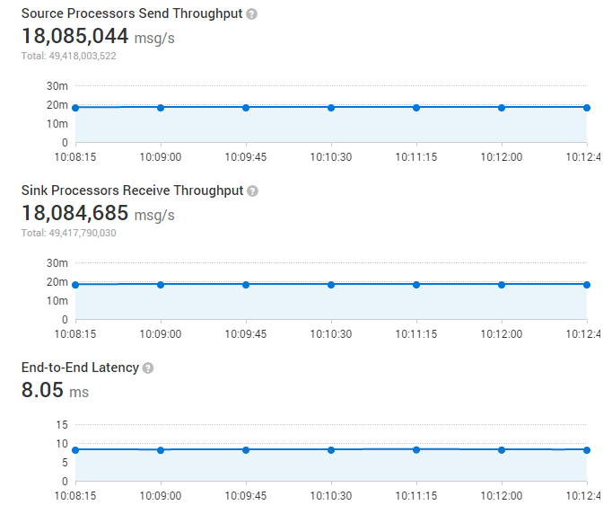

## Gearpump  

[](https://maven-badges.herokuapp.com/maven-central/io.github.gearpump/gearpump-core_2.12)
[](LICENSE)
[](https://travis-ci.org/gearpump/gearpump?branch=master)
[](https://codecov.io/github/gearpump/gearpump?branch=master)
[](https://gitter.im/gearpump/gearpump)

Gearpump is a lightweight real-time big data streaming engine. It is inspired by recent advances in the [Akka](https://github.com/akka/akka) framework and a desire to improve on existing streaming frameworks.

The name Gearpump is a reference to the engineering term "gear pump", which is a super simple pump that consists of only two gears, but is very powerful at streaming water.


We model streaming within the Akka actor hierarchy.


Per initial benchmarks we are able to process near 18 million messages/second (100 bytes per message) with a 8ms latency on a 4-node cluster.



For steps to reproduce the performance test, please check [Performance benchmark](http://gearpump.apache.org/releases/latest/introduction/performance-report/index.html).

## Useful Resources

* Read the [Introduction on TypeSafe's Blog](https://typesafe.com/blog/gearpump-real-time-streaming-engine-using-akka)
* Learn the [Basic Concepts](http://gearpump.apache.org/releases/latest/introduction/basic-concepts/index.html)
* How to [Develop your first application](http://gearpump.apache.org/releases/latest/dev/dev-write-1st-app/index.html)
* How to [Submit your first application](http://gearpump.apache.org/releases/latest/introduction/submit-your-1st-application/index.html)
* Explore the [Maven dependencies](http://gearpump.apache.org/downloads.html#maven-dependencies)
* Explore the [Document site](http://gearpump.apache.org)
* Explore the [User Mailing List](http://mail-archives.apache.org/mod_mbox/incubator-gearpump-user/)
* Report an [issue](https://github.com/gearpump/gearpump/issues)

## How to Build

1). Clone the Gearpump repository

```bash
  git clone https://github.com/gearpump/gearpump.git
  cd gearpump
```

2). Build package

```bash
  ## Please use scala 2.12
  ## The target package path: output/target/gearpump-${version}.zip
  sbt clean +assembly +packArchiveZip
```

  After the build, there will be a package file gearpump-${version}.zip generated under output/target/ folder.

  To build scala document, use
```bash
   ## Will generate the scala doc under target/scala_2.xx/unidoc/
   sbt unidoc
```  

  **NOTE:**
The build requires network connection. If you are behind an enterprise proxy, make sure you have set the proxy in your env before running the build commands.
For windows:

```bash
set HTTP_PROXY=http://host:port
set HTTPS_PROXY= http://host:port
```

For Linux:

```bash
export HTTP_PROXY=http://host:port
export HTTPS_PROXY=http://host:port
```

## How to do style check before submitting a pull request?

Before submitting a PR, you should always run style check first:
```
  ## Run style check for compile, test, and integration test.
  sbt scalastyle test:scalastyle it:scalastyle
```

## How to generate the license report to generate a list of all dependencies 
```
  sbt dumpLicenseReport
```

## How to generate dependencies by declared license
```
  sbt dependencyLicenseInfo
```

## Contributors (time order)

* [Sean Zhong](https://github.com/clockfly)
* [Kam Kasravi](https://github.com/kkasravi)
* [Manu Zhang](https://github.com/manuzhang)
* [Huafeng Wang](https://github.com/huafengw)
* [Weihua Jiang](https://github.com/whjiang)
* [Suneel Marthi](https://github.com/smarthi)
* [Stanley Xu](https://github.com/stanleyxu2005)
* [Tomasz Targonski](https://github.com/TomaszT)
* [Sun Kewei](https://github.com/skw1992)
* [Gong Yu](https://github.com/pangolulu)
* [Karol Brejna](https://github.com/karol-brejna-i)

## License

Gearpump itself is licensed under the [Apache License (2.0)](http://www.apache.org/licenses/LICENSE-2.0).
For library it used, please see [LICENSE](https://github.com/gearpump/gearpump/blob/master/LICENSE.bin).

## Acknowledgement

The netty transport code work is based on [Apache Storm](http://storm.apache.org). Thanks Apache Storm contributors.

The cgroup code work is based on [JStorm](https://github.com/alibaba/jstorm). Thanks JStorm contributors.

Thanks to Jetbrains for providing a [IntelliJ IDEA Free Open Source License](https://www.jetbrains.com/buy/opensource/?product=idea).
