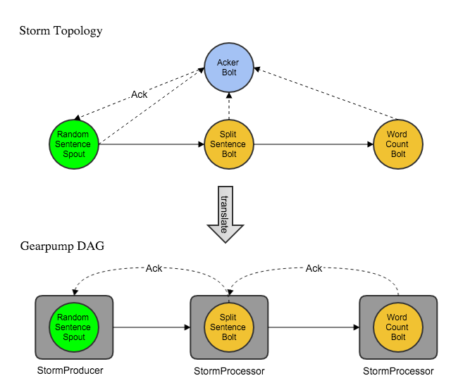

Gearpump provides **binary compatibility** for Apache Storm applications. That is to say, users could easily grab an existing Storm jar and run it 
on Gearpump. This documentation illustrates Gearpump's compatibility with Storm.  

## What Storm features are supported on Gearpump 

### Storm 0.9.x

| Feature | Support |
| ------- | ------- |
| basic topology | yes |
| DRPC | yes |
| multi-lang | yes |
| storm-kafka | yes |
| Trident | no |

### Storm 0.10.x

| Feature | Support |
| ----------- | -------------|
| basic topology | yes | 
| DRPC | yes |
| multi-lang | yes |
| storm-kafka | yes |
| storm-hdfs| yes | 
| storm-hbase | yes |
| storm-hive | yes |
| storm-jdbc | yes |
| storm-redis | yes |
| flux | yes |
| storm-eventhubs | not verified |
| Trident | no |

### At Least Once support

With Ackers enabled, there are two kinds of At Least Once support in both Storm 0.9.x and Storm 0.10.x.

1. spout will replay messages on message loss as long as spout is alive
2. If `KafkaSpout` is used, messages could be replayed from Kafka even if the spout crashes. 

Gearpump supports the second for both Storm versions. 

### Security support 

Storm 0.10.x adds security support for following connectors 

* [storm-hdfs](https://github.com/apache/storm/blob/0.10.x-branch/external/storm-hdfs/README.md)
* [storm-hive](https://github.com/apache/storm/blob/0.10.x-branch/external/storm-hive/README.md)
* [storm-hbase](https://github.com/apache/storm/blob/0.10.x-branch/external/storm-hbase/README.md)

That means users could access kerberos enabled HDFS, Hive and HBase with these connectors. Generally, Storm provides two approaches (please refer to above links for more information)

1. configure nimbus to automatically get delegation tokens on behalf of the topology submitter user
2. kerberos keytabs are already distributed on worker hosts; users configure keytab path and principal

Gearpump supports the second approach and users needs to add classpath of HDFS/Hive/HBase to `gearpump.executor.extraClasspath` in `gear.conf` on each node. For example, 

	:::json
	###################
	### Executor argument configuration
	### Executor JVM can contains multiple tasks
	###################
	executor {
	vmargs = "-server -Xms512M -Xmx1024M -Xss1M -XX:+HeapDumpOnOutOfMemoryError -XX:+UseConcMarkSweepGC -XX:CMSInitiatingOccupancyFraction=80 -XX:+UseParNewGC -XX:NewRatio=3  -Djava.rmi.server.hostname=localhost"
	extraClasspath = "/etc/hadoop/conf"
	}

## How to run a Storm application on Gearpump

This section shows how to run an existing Storm jar in a local Gearpump cluster.

1. launch a local cluster
  
		:::bash   
		bin/local
   

2. start a Gearpump Nimbus server 

	Users need server's address(`nimbus.host` and `nimbus.thrift.port`) to submit topologies later. The address is written to a yaml config file set with `-output` option. 
	Users can provide an existing config file where only the address will be overwritten. If not provided, a new file `app.yaml` is created with the config.

		:::bash
		bin/storm nimbus -output [conf <custom yaml config>]
   
   
3. submit Storm applications

	Users can either submit Storm applications through command line or UI. 
   
	a. submit Storm applications through command line

		:::bash
		bin/storm app -verbose -config app.yaml -jar storm-starter-${STORM_VERSION}.jar storm.starter.ExclamationTopology exclamation 
     
  
	Users are able to configure their applications through following options
   
     * `jar` - set the path of a Storm application jar
     * `config` - submit the custom configuration file generated when launching Nimbus
  
  
	b. submit Storm application through UI
   
     1. Click on the "Create" button on the applications page on UI. 
     2. Click on the "Submit Storm Application" item in the pull down menu.
     3. In the popup console, upload the Storm application jar and the configuration file generated when launching Nimbus,
         and fill in `storm.starter.ExclamationTopology exclamation` as arguments.
     4. Click on the "Submit" button   

   Either way, check the dashboard and you should see data flowing through your topology. 
  
## How is it different from running on Storm

### Topology submission

When a client submits a Storm topology, Gearpump launches locally a simplified version of Storm's  Nimbus server `GearpumpNimbus`. `GearpumpNimbus` then translates topology to a directed acyclic graph (DAG) of Gearpump, which is submitted to Gearpump master and deployed as a Gearpump application. 

`GearpumpNimbus` supports the following methods
  
* `submitTopology` / `submitTopologyWithOpts`
* `killTopology` / `killTopologyWithOpts`
* `getTopology` / `getUserTopology`
* `getClusterInfo`

### Topology translation

Here's an example of `WordCountTopology` with acker bolts (ackers) being translated into a Gearpump DAG.

Gearpump creates a `StormProducer` for each Storm spout and a `StormProcessor` for each Storm bolt (except for ackers) with the same parallelism, and wires them together using the same grouping strategy (partitioning in Gearpump) as in Storm. 

At runtime, spouts and bolts are running inside `StormProducer` tasks and `StormProcessor` tasks respectively. Messages emitted by spout are passed to `StormProducer`, transferred to `StormProcessor` and passed down to bolt.  Messages are serialized / de-serialized with Storm serializers.

Storm ackers are dropped since Gearpump has a different mechanism of message tracking and flow control. 

### Task execution

Each Storm task is executed by a dedicated thread while all Gearpump tasks of an executor share a thread pool. Generally, we can achieve better performance with a shared thread pool. It's possible, however, some tasks block and take up all the threads. In that case, we can 
fall back to the Storm way by setting `gearpump.task-dispatcher` to `"gearpump.single-thread-dispatcher"` in `gear.conf`.

### Message tracking 

Storm tracks the lineage of each message with ackers to guarantee at-least-once message delivery. Failed messages are re-sent from spout.

Gearpump [tracks messages between a sender and receiver in an efficient way](../internals/gearpump-internals#how-do-we-detect-message-loss). Message loss causes the whole application to replay from the [minimum timestamp of all pending messages in the system](../internals/gearpump-internals#application-clock-and-global-clock-service). 

### Flow control

Storm throttles flow rate at spout, which stops sending messages if the number of unacked messages exceeds `topology.max.spout.pending`. 

Gearpump has flow control between tasks such that [sender cannot flood receiver](../internals/gearpump-internals#how-do-we-do-flow-control), which is backpressured till the source.

### Configurations

All Storm configurations are respected with the following priority order 

	:::bash
	defaults.yaml < custom file config < application config < component config

where

* application config is submit from Storm application along with the topology 
* component config is set in spout / bolt with `getComponentConfiguration`
* custom file config is specified with the `-config` option when submitting Storm application from command line or uploaded from UI

## StreamCQL Support

[StreamCQL](https://github.com/HuaweiBigData/StreamCQL) is a Continuous Query Language on RealTime Computation System open sourced by Huawei.
Since StreamCQL already supports Storm, it's straightforward to run StreamCQL over Gearpump.

1. Install StreamCQL as in the official [README](https://github.com/HuaweiBigData/StreamCQL#install-streamcql)

2. Launch Gearpump Nimbus Server as before 

3. Go to the installed stream-cql-binary, and change following settings in `conf/streaming-site.xml` with the output Nimbus configs in Step 2.

		:::xml
		<property>
		  <name>streaming.storm.nimbus.host</name>
		  <value>${nimbus.host}</value>
		</property>
		<property>
		  <name>streaming.storm.nimbus.port</name>
		  <value>${nimbus.thrift.port}</value>
		</property>
   
 
4. Open CQL client shell with `bin/cql` and execute a simple cql example  

		:::sql
		Streaming> CREATE INPUT STREAM s
		   (id INT, name STRING, type INT)
		SOURCE randomgen
		   PROPERTIES ( timeUnit = "SECONDS", period = "1",
		       eventNumPerperiod = "1", isSchedule = "true" );
		   
		CREATE OUTPUT STREAM rs
		   (type INT, cc INT)
		SINK consoleOutput;
		   
		INSERT INTO STREAM rs SELECT type, COUNT(id) as cc
		   FROM s[RANGE 20 SECONDS BATCH]
		   WHERE id > 5 GROUP BY type;
		   
		SUBMIT APPLICATION example;    
   
   
5. Check the dashboard and you should see data flowing through a topology of 3 components.

