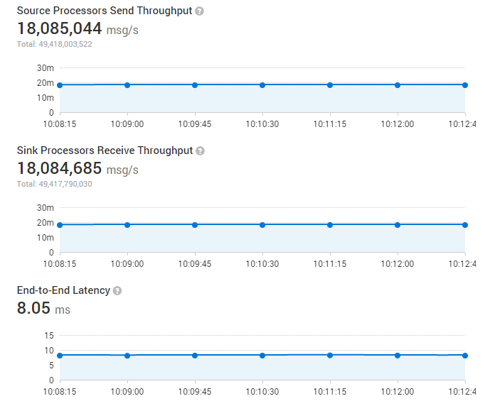

Gearpump is a real-time big data streaming engine.
It is inspired by recent advances in the [Apache Pekko](https://pekko.apache.org/) framework and a desire to improve on existing streaming frameworks.
Gearpump is event/message based and featured as low latency handling, high performance, exactly once semantics,
dynamic topology update, and a low-level processor graph API.

The	name	Gearpump	is	a	reference to	the	engineering term "gear	pump,"	which	is	a	super simple
pump	that	consists of	only	two	gears,	but	is	very	powerful at	streaming water.

### Gearpump Technical Highlights
Gearpump's feature set includes:

* Extremely high performance
* Low latency
* Configurable message delivery guarantee (at least once, exactly once).
* Highly extensible
* Dynamic DAG
* Samoa compatibility
* Low-level Processor and DataSource/DataSink APIs

### Gearpump Performance
Per initial benchmarks we are able to process 18 million messages/second (100 bytes per message) with a 8ms latency on a 4-node cluster.

