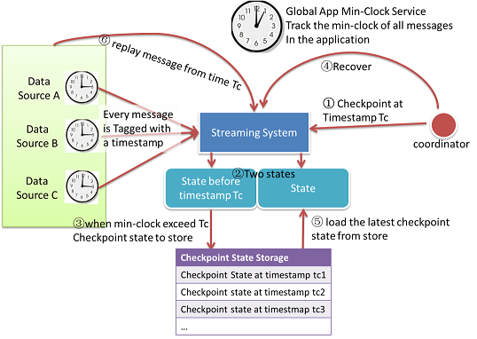
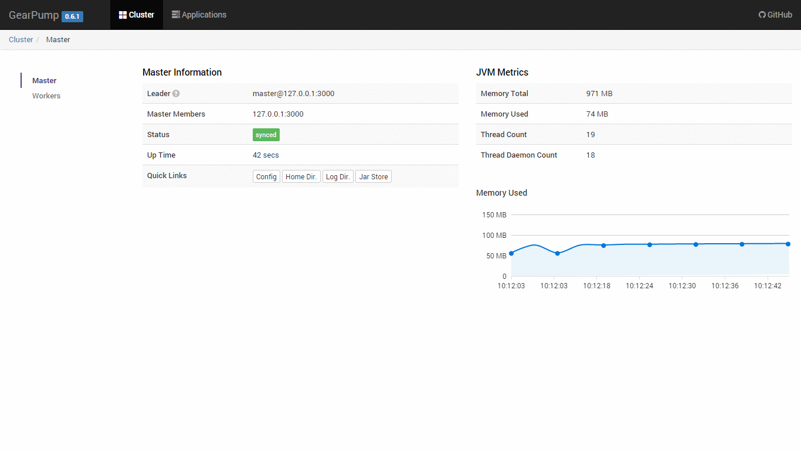

### Technical highlights of Gearpump

Gearpump is a high performance, flexible, fault-tolerant, and responsive streaming platform with a lot of nice features, its technical highlights include:

#### Actors everywhere

The Actor model is a concurrency model proposed by Carl Hewitt at 1973. The Actor model is like a micro-service which is cohesive in the inside and isolated from other outside actors. Actors are the cornerstone of Gearpump, they provide facilities to do message passing, error handling, liveliness monitoring. Gearpump uses Actors everywhere; every entity within the cluster that can be treated as a service.

#### Exactly once Message Processing

Exactly once is defined as: the effect of a message will be calculated only once in the persisted state and computation errors in the history will not be propagated to future computations.

#### Topology DAG DSL

User can submit to Gearpump a computation DAG, which contains a list of nodes and edges, and each node can be parallelized to a set of tasks. Gearpump will then schedule and distribute different tasks in the DAG to different machines automatically. Each task will be started as an actor, which is long running micro-service.

#### Flow control

Gearpump has built-in support for flow control. For all message passing between different tasks, the framework will assure the upstream tasks will not flood the downstream tasks.

#### No inherent end to end latency

Gearpump is a message level streaming engine, which means every task in the DAG will process messages immediately upon receiving, and deliver messages to downstream immediately without waiting. Gearpump doesn't do batching when data sourcing.

#### High Performance message passing

By implementing smart batching strategies, Gearpump is extremely effective in transferring small messages. In one test of 4 machines, the whole cluster throughput can reach 18 million messages per second, with message size of 100 bytes.

#### High availability, No single point of failure

Gearpump has a careful design for high availability. We have considered message loss, worker machine crash, application crash, master crash, brain-split, and have made sure Gearpump recovers when these errors may occur. When there is message loss, the lost message will be replayed; when there is a worker machine crash or application crash, the related computation tasks will be rescheduled on new machines. For master high availability, several master nodes will form a Akka cluster, and CRDTs (conflict free data types) are used to exchange the state, so as long as there is still a quorum, the master will stay functional. When one master node fails, other master nodes in the cluster will take over and state will be recovered.

#### Dynamic Computation DAG

Gearpump provides a feature which allows the user to dynamically add, remove, or replace a sub graph at runtime, without the need to restart the whole computation topology.

#### Able to handle out of order messages

For a window operation like moving average on a sliding window, it is important to make sure we have received all messages in that time window so that we can get an accurate result, but how do we handle stranglers or late arriving messages? Gearpump solves this problem by tracking the low watermark of timestamp of all messages, so it knows whether we've received all the messages in the time window or not.

#### Customizable platform

Different applications have different requirements related to performance metrics, some may want higher throughput, some may require strong eventual data consistency; and different applications have different resource requirements profiles, some may demand high CPU performance, some may require data locality. Gearpump meets these requirements by allowing the user to arbitrate between different performance metrics and define customized resource scheduling strategies.

#### Built-in Dashboard UI

Gearpump has a built-in dashboard UI to manage the cluster and visualize the applications. The UI uses REST calls to connect with backend, so it is easy to embed the UI within other dashboards.

#### Data connectors for Kafka and HDFS

Gearpump has built-in data connectors for Kafka and HDFS. For the Kafka connector, we support message replay from a specified timestamp.
