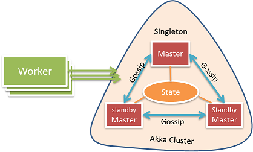
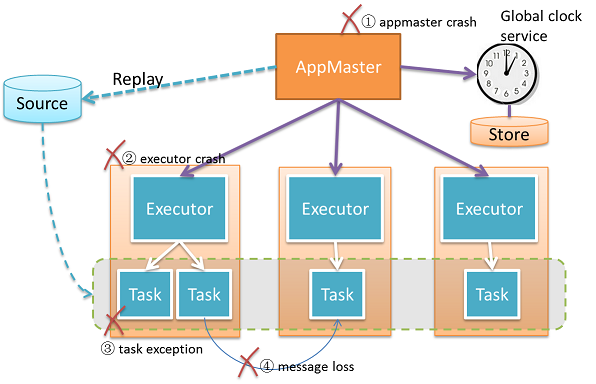
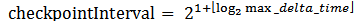

### Actor Hierarchy?

Everything in the diagram is an actor; they fall into two categories, Cluster Actors and Application Actors.

#### Cluster Actors

  **Worker**: Maps to a physical worker machine. It is responsible for managing resources and report metrics on that machine.

  **Master**: Heart of the cluster, which manages workers, resources, and applications. The main function is delegated to three child actors, App Manager, Worker Manager, and Resource Scheduler.

#### Application Actors:

  **AppMaster**: Responsible to schedule the tasks to workers and manage the state of the application. Different applications have different AppMaster instances and are isolated.

  **Executor**: Child of AppMaster, represents a JVM process. Its job is to manage the life cycle of tasks and recover the tasks in case of failure.

  **Task**: Child of Executor, does the real job. Every task actor has a global unique address. One task actor can send data to any other task actors. This gives us great flexibility of how the computation DAG is distributed.

  All actors in the graph are weaved together with actor supervision, and actor watching and every error is handled properly via supervisors. In a master, a risky job is isolated and delegated to child actors, so it's more robust. In the application, an extra intermediate layer "Executor" is created so that we can do fine-grained and fast recovery in case of task failure. A master watches the lifecycle of AppMaster and worker to handle the failures, but the life cycle of Worker and AppMaster are not bound to a Master Actor by supervision, so that Master node can fail independently.  Several Master Actors form an Akka cluster, the Master state is exchanged using the Gossip protocol in a conflict-free consistent way so that there is no single point of failure. With this hierarchy design, we are able to achieve high availability.

### Application Clock and Global Clock Service

Global clock service will track the minimum time stamp of all pending messages in the system. Every task will update its own minimum-clock to global clock service; the minimum-clock of task is decided by the minimum of:

  - Minimum time stamp of all pending messages in the inbox.
  - Minimum time stamp of all un-acked outgoing messages. When there is message loss, the minimum clock will not advance.
  - Minimum clock of all task states. If the state is accumulated by a lot of input messages, then the clock value is decided by the oldest message's timestamp. The state clock will advance by doing snapshots to persistent storage or by fading out the effect of old messages.

The global clock service will keep track of all task minimum clocks effectively and maintain a global view of minimum clock. The global minimum clock value is monotonically increasing; it means that all source messages before this clock value have been processed. If there is message loss or task crash, the global minimum clock will stop.

### How do we optimize the message passing performance?

For streaming application, message passing performance is extremely important. For example, one streaming platform may need to process millions of messages per second with millisecond level latency. High throughput and low latency is not that easy to achieve. There are a number of challenges:

#### First Challenge: Network is not efficient for small messages

In streaming, typical message size is very small, usually less than 100 bytes per message, like the floating car GPS data. But network efficiency is very bad when transferring small messages. As you can see in below diagram, when message size is 50 bytes, it can only use 20% bandwidth. How to improve the throughput?

#### Second Challenge: Message overhead is too big

For each message sent between two actors, it contains sender and receiver actor path. When sending over the wire, the overhead of this ActorPath is not trivial. For example, the below actor path takes more than 200 bytes.

	:::bash
	akka.tcp://system1@192.168.1.53:51582/remote/akka.tcp/2120193a-e10b-474e-bccb-8ebc4b3a0247@192.168.1.53:48948/remote/akka.tcp/system2@192.168.1.54:43676/user/master/Worker1/app_0_executor_0/group_1_task_0#-768886794

#### How do we solve this?

We implement a custom Netty transportation layer with Akka extension. In the below diagram, Netty Client will translate ActorPath to TaskId, and Netty Server will translate it back. Only TaskId will be passed on wire, it is only about 10 bytes, the overhead is minimized. Different Netty Client Actors are isolated; they will not block each other.

For performance, effective batching is really the key! We group multiple messages to a single batch and send it on the wire. The batch size is not fixed; it is adjusted dynamically based on network status. If the network is available, we will flush pending messages immediately without waiting; otherwise we will put the message in a batch and trigger a timer to flush the batch later.

### How do we do flow Control?

Without flow control, one task can easily flood another task with too many messages, causing out of memory error. Typical flow control will use a TCP-like sliding window, so that source and target can run concurrently without blocking each other.

Figure: Flow control, each task is "star" connected to input tasks and output tasks

The difficult part for our problem is that each task can have multiple input tasks and output tasks. The input and output must be geared together so that the back pressure can be properly propagated from downstream to upstream. The flow control also needs to consider failures, and it needs to be able to recover when there is message loss.
Another challenge is that the overhead of flow control messages can be big. If we ack every message, there will be huge amount of acked messages in the system, degrading streaming performance. The approach we adopted is to use explicit AckRequest message. The target tasks will only ack back when they receive the AckRequest message, and the source will only send AckRequest when it feels necessary. With this approach, we can largely reduce the overhead.

### How do we detect message loss?

For example, for web ads, we may charge for every click, we don't want to miscount.  The streaming platform needs to effectively track what messages have been lost, and recover as fast as possible.

Figure: Message Loss Detection

We use the flow control message AckRequest and Ack to detect message loss. The target task will count how many messages has been received since last AckRequest, and ack the count back to source task. The source task will check the count and find message loss.
This is just an illustration, the real case is more difficulty, we need to handle zombie tasks, and in-the-fly stale messages.

### How Gearpump know what messages to replay?

In some applications, a message cannot be lost, and must be replayed. For example, during the money transfer, the bank will SMS us the verification code. If that message is lost, the system must replay it so that money transfer can continue. We made the decision to use **source end message storage** and **time stamp based replay**.

Figure: Replay with Source End Message Store

Every message is immutable, and tagged with a timestamp. We have an assumption that the timestamp is approximately incremental (allow small ratio message disorder).

We assume the message is coming from a replay-able source, like Kafka queue; otherwise the message will be stored at customizable source end "message store". When the source task sends the message downstream, the timestamp and offset of the message is also check-pointed to offset-timestamp storage periodically. During recovery, the system will first retrieve the right time stamp and offset from the offset-timestamp storage, then it will replay the message store from that time stamp and offset. A Timestamp Filter will filter out old messages in case the message in message store is not strictly time-ordered.

### Master High Availability

In a distributed streaming system, any part can fail. The system must stay responsive and do recovery in case of errors.

Figure: Master High Availability

We use Akka clustering to implement the Master high availability. The cluster consists of several master nodes, but no worker nodes. With clustering facilities, we can easily detect and handle the failure of master node crash. The master state is replicated on all master nodes with the Typesafe akka-data-replication  library, when one master node crashes, another standby master will read the master state and take over. The master state contains the submission data of all applications. If one application dies, a master can use that state to recover that application. CRDT LwwMap  is used to represent the state; it is a hash map that can converge on distributed nodes without conflict. To have strong data consistency, the state read and write must happen on a quorum of master nodes.

### How we do handle failures?

With Akka's powerful actor supervision, we can implement a resilient system relatively easy. In Gearpump, different applications have a different AppMaster instance, they are totally isolated from each other. For each application, there is a supervision tree, AppMaster->Executor->Task. With this supervision hierarchy, we can free ourselves from the headache of zombie process, for example if AppMaster is down, Akka supervisor will ensure the whole tree is shutting down.

There are multiple possible failure scenarios

Figure: Possible Failure Scenarios and Error Supervision Hierarchy

#### What happens when the Master crashes?

In case of a master crash, other standby masters will be notified, they will resume the master state, and take over control. Worker and AppMaster will also be notified, They will trigger a process to find the new active master, until the resolution complete. If AppMaster or Worker cannot resolve a new Master in a time out, they will make suicide and kill themselves.

#### What happens when a worker crashes?

In case of a worker crash, the Master will get notified and stop scheduling new computation to this worker. All supervised executors on current worker will be killed, AppMaster can treat it as recovery of executor crash like [What happen when an executor crashes?](#what-happen-when-an-executor-crashes)

#### What happens when the AppMaster crashes?

If an AppMaster crashes, Master will schedule a new resource to create a new AppMaster Instance elsewhere, and then the AppMaster will handle the recovery inside the application. For streaming, it will recover the latest min clock and other state from disk, request resources from master to start executors, and restart the tasks with recovered min clock.

#### What happen when an executor crashes?

If an executor crashes, its supervisor AppMaster will get notified, and request a new resource from the active master to start a new executor, to run the tasks which were located on the crashed executor.

#### What happen when tasks crash?

If a task throws an exception, its supervisor executor will restart that Task.

When "at least once" message delivery is enabled, it will trigger the message replaying in the case of message loss. First AppMaster will read the latest minimum clock from the global clock service(or clock storage if the clock service crashes), then AppMaster will restart all the task actors to get a fresh task state, then the source end tasks will replay messages from that minimum clock.

### How does "exactly-once" message delivery work?

For some applications, it is extremely important to do "exactly once" message delivery. For example, for a real-time billing system, we will not want to bill the customer twice. The goal of "exactly once" message delivery is to make sure:
  The error doesn't accumulate, today's error will not be accumulated to tomorrow.
  Transparent to application developer
We use global clock to synchronize the distributed transactions. We assume every message from the data source will have a unique timestamp, the timestamp can be a part of the message body, or can be attached later with system clock when the message is injected into the streaming system. With this global synchronized clock, we can coordinate all tasks to checkpoint at same timestamp.

Figure: Checkpointing and Exactly-Once Message delivery

Workflow to do state checkpointing:

1. The coordinator asks the streaming system to do checkpoint at timestamp Tc.
2. For each application task, it will maintain two states, checkpoint state and current state. Checkpoint state only contains information before timestamp Tc. Current state contains all information.
3. When global minimum clock is larger than Tc, it means all messages older than Tc has been processed; the checkpoint state will no longer change, so we will then persist the checkpoint state to storage safely.
4. When there is message loss, we will start the recovery process.
5. To recover, load the latest checkpoint state from store, and then use it to restore the application status.
6. Data source replays messages from the checkpoint timestamp.

The checkpoint interval is determined by global clock service dynamically. Each data source will track the max timestamp of input messages. Upon receiving min clock updates, the data source will report the time delta back to global clock service. The max time delta is the upper bound of the application state timespan. The checkpoint interval is bigger than max delta time:

Figure: How to determine Checkpoint Interval

After the checkpoint interval is notified to tasks by global clock service, each task will calculate its next checkpoint timestamp autonomously without global synchronization.

For each task, it contains two states, checkpoint state and current state. The code to update the state is shown in listing below.

	:::python
	TaskState(stateStore, initialTimeStamp):
	  currentState = stateStore.load(initialTimeStamp)
	  checkpointState = currentState.clone
	  checkpointTimestamp = nextCheckpointTimeStamp(initialTimeStamp)
	onMessage(msg):
	  if (msg.timestamp < checkpointTimestamp):
	    checkpointState.updateMessage(msg)
	  currentState.updateMessage(msg)  
	  maxClock = max(maxClock, msg.timeStamp)
	
	onMinClock(minClock):
	  if (minClock > checkpointTimestamp):
	    stateStore.persist(checkpointState)
	    checkpointTimeStamp = nextCheckpointTimeStamp(maxClock)
	    checkpointState = currentState.clone
	
	onNewCheckpointInterval(newStep):
	  step = newStep  
	nextCheckpointTimeStamp(timestamp):
	  checkpointTimestamp = (1 + timestamp/step) * step
	

List 1: Task Transactional State Implementation

### What is dynamic graph, and how it works?

The DAG can be modified dynamically. We want to be able to dynamically add, remove, and replace a sub-graph.

Figure: Dynamic Graph, Attach, Replace, and Remove

## At least once message delivery and Kafka

The Kafka source example project and tutorials can be found at:
- [Kafka connector example project](https://github.com/apache/incubator-gearpump/tree/master/examples/streaming/kafka)
- [Connect with Kafka source](../dev/dev-connectors)

In this doc, we will talk about how the at least once message delivery works.

We will use the WordCount example of [source tree](https://github.com/apache/incubator-gearpump/tree/master/examples/streaming/kafka)  to illustrate.

### How the kafka WordCount DAG looks like:

It contains three processors:

- KafkaStreamProducer(or KafkaSource) will read message from kafka queue.
- Split will split lines to words
- Sum will summarize the words to get a count for each word.

### How to read data from Kafka

We use KafkaSource, please check [Connect with Kafka source](../dev/dev-connectors) for the introduction.

Please note that we have set a startTimestamp for the KafkaSource, which means KafkaSource will read from Kafka queue starting from messages whose timestamp is near startTimestamp.

### What happen where there is Task crash or message loss?
When there is message loss, the AppMaster will first pause the global clock service so that the global minimum timestamp no longer change, then it will restart the Kafka source tasks. Upon restart, Kafka Source will start to replay. It will first read the global minimum timestamp from AppMaster, and start to read message from that timestamp.

### What method KafkaSource used to read messages from a start timestamp? As we know Kafka queue doesn't expose the timestamp information.

Kafka queue only expose the offset information for each partition. What KafkaSource do is to maintain its own mapping from Kafka offset to  Application timestamp, so that we can map from a application timestamp to a Kafka offset, and replay Kafka messages from that Kafka offset.

The mapping between Application timestamp with Kafka offset is stored in a distributed file system or as a Kafka topic.
