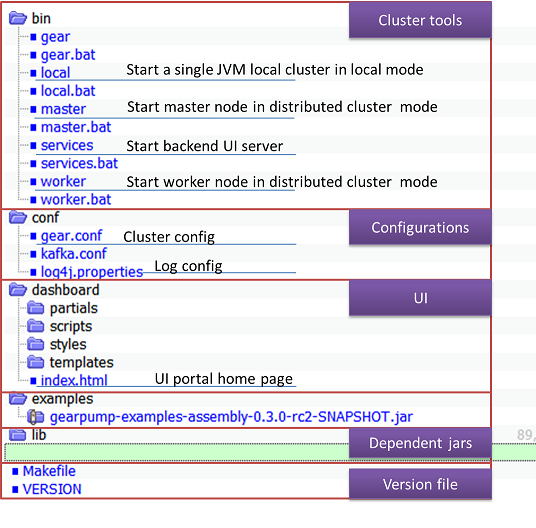

### Prepare the binary
You can either download pre-build release package or choose to build from source code.

#### Download Release Binary

If you choose to use pre-build package, then you don't need to build from source code. The release package can be downloaded from:

##### [Download page](/download.html)

#### Build from Source code

If you choose to build the package from source code yourself, you can follow these steps:

1). Clone the GearPump repository

```bash
  git clone https://github.com/gearpump/gearpump.git
  cd gearpump
```

2). Build package

```bash
  ## Please use scala 2.11
  ## The target package path: target/gearpump-$VERSION.tar.gz
  sbt clean assembly packArchiveZip
```

  After the build, there will be a package file gearpump-${version}.tar.gz generated under target/ folder.

  **NOTE:**
  Please set JAVA_HOME environment before the build.

  On linux:

```bash
  export JAVA_HOME={path/to/jdk/root/path}
```

  On Windows:

```bash
  set JAVA_HOME={path/to/jdk/root/path}
```

  **NOTE:**
The build requires network connection. If you are behind an enterprise proxy, make sure you have set the proxy in your env before running the build commands.
For windows:

```bash
Set HTTP_PROXY=http://host:port
set HTTPS_PROXT= http://host:port
```

For Linux:

```bash
export HTTP_PROXY=http://host:port
export HTTPS_PROXT= http://host:port
```

### Gearpump package structure

You need to flatten the .tar.gz file to use it, on Linux, you can

```bash
## please replace ${version} below with actual version used
tar  -zxvf gearpump-${version}.tar.gz
```

After decompression, the directory structure looks like picture 1.



Under bin/ folder, there are script files for Linux(bash script) and Windows(.bat script).

script | function
--------|------------
local | You can start the Gearpump cluster in single JVM(local mode), or in a distributed cluster(cluster mode). To start the cluster in local mode, you can use the local /local.bat helper scripts, it is very useful for developing or troubleshooting.
master | To start Gearpump in cluster mode, you need to start one or more master nodes, which represent the global resource management center. master/master.bat is launcher script to boot the master node.
worker | To start Gearpump in cluster mode, you also need to start several workers, with each worker represent a set of local resources. worker/worker.bat is launcher script to start the worker node.
services | This script is used to start backend REST service and other services for frontend UI dashboard.

Please check [Command Line Syntax](commandline.html) for more information for each script.
