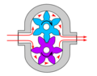
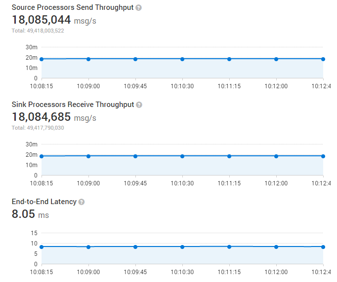
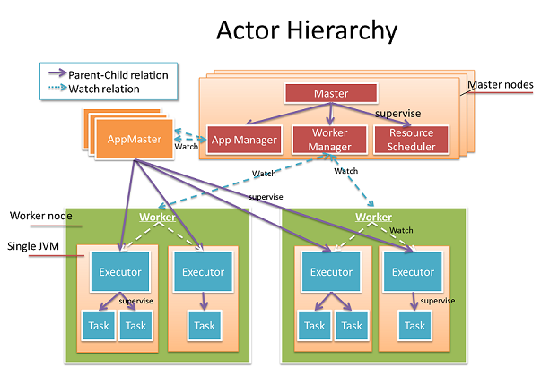

GearPump is a real-time big data streaming engine.
It is inspired by recent advances in the [Akka](http://akka.io/) framework and a desire to improve on existing streaming frameworks.
Gearpump is event/message based and featured as low latency handling, high performance, exactly once semantics,
dynamic topology update, [Apache Storm](https://storm.apache.org/) compatibility, etc.

The	name	GearPump	is	a	reference to	the	engineering term "gear	pump,"	which	is	a	super simple
pump	that	consists of	only	two	gears,	but	is	very	powerful at	streaming water.

### Gearpump Technical Highlights
GearPump is a modern big data real-time streaming engine which has many unique features:

* Extremely high performance
* Low latency
* Configurable message delivery guarantee (at least once, exactly once).
* Highly extensible
* Dynamic DAG
* Storm compatibility
* Samoa compatibility
* widely IoT connectivity
* Both high level and low level API

### Gearpump Performance
Per initial benchmarks we are able to process 11 million messages/second (100 bytes per message) with a 17ms latency on a 4-node cluster.

### Gearpump and Akka
Gearump is a 100% Akka based platform. We model big data streaming within the Akka actor hierarchy.

