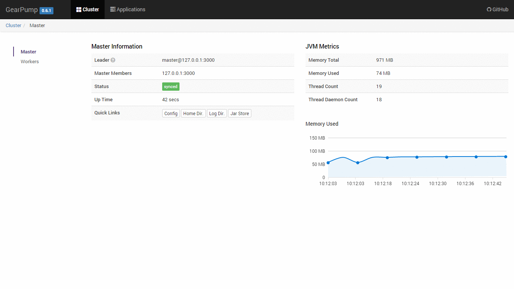

Before you can submit and run your first Gearpump application, you will need a running Gearpump service.
There are multiple ways to run Gearpump [Local mode](deployment-local.html), [Standalone mode](deployment-standalone.html), [YARN mode](deployment-yarn.html) or [Docker mode](deployment-docker.html).

The easiest way is to run Gearpump in [Local mode](deployment-local.html).
Any Linux, MacOSX or Windows desktop can be used with zero configuration.

In the example below, we assume your are running in [Local mode](deployment-local.html).
If you running Gearpump in one of the other modes, you will need to configure the Gearpump client to
connect to the Gearpump service by setting the `gear.conf` configuration path in classpath.
Within this file, you will need to change the parameter `gearpump.cluster.masters` to the correct Gearpump master(s).
See [Configuration](deployment-configuration.html) for details.

## Steps to submit your first Application

### Step 1: Submit application
After the cluster is started, you can submit an example wordcount application to the cluster

Open another shell,

```bash
### To run WordCount example
bin/gear app -jar examples/gearpump-examples-assembly-{{site.SCALA_BINARY_VERSION}}-{{site.GEARPUMP_VERSION}}.jar io.gearpump.streaming.examples.wordcount.WordCount
```

###  Step 2: Congratulations, you've submitted your first application.

To view the application status and metrics, start the Web UI services, and browse to [http://127.0.0.1:8090](http://127.0.0.1:8090) to check the status.


**NOTE:** the UI port setting can be defined in configuration, please check section [Configuration](deployment-configuration.html).

## A quick Look at the Web UI
TBD

## Other Application Examples
Besides wordcount, there are several other example applications. Please check the source tree examples/ for detail information.
